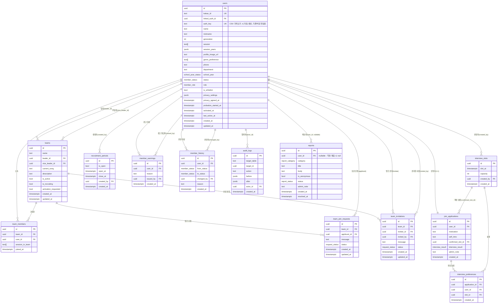

# ERD 명세서 — 청림그룹사운드 플랫폼

> 코드 기반 역추적 버전 (2026-06-10, 리팩토링 반영)  
> 원본: `platform/src/types/database.ts`, `document/spec/migrations/*.sql`

---

## 1. 엔티티 관계도 (Mermaid ERD)

---

## 2. 열거형 (Enums)

### `member_status`
| 값 | 설명 | 전이 가능 대상 |
|----|------|--------------|
| `PENDING` | 가입 신청 전 / 미연동 | → INTERVIEWING |
| `INTERVIEWING` | 면접 대기 중 | → ACTIVE, WITHDRAWN |
| `PROBATION` | 수습 부원 | → ACTIVE, INACTIVE, WITHDRAWN |
| `ACTIVE` | 정식 부원 | → INACTIVE, WITHDRAWN |
| `INACTIVE` | 활동 중단 | → ACTIVE, WITHDRAWN |
| `WITHDRAWN` | 탈퇴 | (종료 상태) |

### `member_role`
| 값 | 설명 |
|----|------|
| `SUPER_ADMIN` | 개발 담당 (최고 권한) |
| `ADMIN` | 운영진 |
| `MEMBER` | 정식 부원 |
| `PROBATION_MEMBER` | 유예 부원 |

> 팀장 여부는 `teams.leader_id`로 관리. `TEAM_LEADER` enum 값은 제거됨.

### `school_year_status`
| 값 | UI 표시 | 노출 범위 |
|----|---------|---------|
| `YEAR_1` | 1학년 | 전체 |
| `YEAR_2` | 2학년 | 전체 |
| `YEAR_3` | 3학년 | 전체 |
| `YEAR_4` | 4학년 | 전체 |
| `YEAR_5` | 5학년 | 전체 |
| `COMPLETED` | 수료 | 전체 |
| `ON_LEAVE` | 휴학 | 신규부원 지원서 + 기존부원 프로필 수정만 표시 |
| `GRADUATED` | 졸업 | 신규부원 지원서 + 기존부원 프로필 수정만 표시 |

> 기본 UI(프로필 보기 등)에서는 `ON_LEAVE`, `GRADUATED` 를 선택 목록에 표시하지 않는다. 단, DB enum에 존재하므로 필터·검색에서 값은 사용 가능.

### `interview_result`
| 값 | 설명 |
|----|------|
| `PENDING` | 결과 미입력 |
| `PASS` | 합격 |
| `FAIL` | 불합격 |

### `request_status`
| 값 | 설명 |
|----|------|
| `PENDING` | 처리 대기 |
| `ACCEPTED` | 수락됨 |
| `REJECTED` | 거절됨 |

### `report_category`
| 값 | 설명 |
|----|------|
| `BUG` | 버그·오류 제보 |
| `OPINION` | 의견·건의 |
| `COMPLAINT` | 부원 관련 민원·제보 |
| `OTHER` | 기타 |

### `report_status`
| 값 | 설명 |
|----|------|
| `PENDING` | 접수됨, 미검토 |
| `REVIEWED` | 검토 완료 |
| `RESOLVED` | 처리 완료 |

---

## 3. 테이블 상세 설명

### users
핵심 회원 테이블. Supabase Auth의 `auth.users`와 별도로 관리됨.
- `linked_auth_id`: 기존 부원(kakao_id로 등록)이 새 Kakao 계정으로 로그인했을 때 연결되는 auth UID
- `auth_key`: CSV 가져오기 시 자동 생성되는 개인 인증키(`CL{기수}-XXXX-XXXX`). Unique. 기존 부원이 `/link` 화면에서 입력해 계정을 연동한다. 연동 완료 후에도 필드는 유지(운영진 재발급 가능).
- `session_years` (JSONB): 세션별 경력 연차 — 예: `{"기타": 3, "보컬": 1}`. 본인 및 운영진이 직접 입력. `null` 허용
- `privacy_settings` (JSONB): `{ name, generation, phone, department, school_year }` 각 필드별 공개 범위 (`'all'|'member'|'admin'`)
- `session`: 악기/파트 배열 (예: `['기타', '보컬']`)
- `school_year`: `school_year_status` enum. `int`에서 변경됨.
- `is_whitelist`: 사전 등록된 명단 여부

### teams
밴드/앙상블 팀 단위.
- `activation_requested`: 수습 팀장이 활성화를 신청한 상태 (운영진 승인 대기)
- `is_active`: 운영진이 활성화 승인한 팀만 `true`
- `is_recruiting`: 팀이 직접 제어하는 모집 상태 토글

### join_applications
`users` 와 1:1 관계. 가입 신청서.
- `confirmed_slot_id`: 운영진이 배정한 면접 슬롯 (NULL이면 미배정)
- `interview_result`: 기본값 `PENDING`

### interview_preferences
신청자가 선택한 면접 희망 슬롯 목록.

### recruitment_periods
단일 레코드 (upsert 패턴). 현재 모집 기간 설정.

### member_warnings
경고 누적 시 자동 탈퇴 처리 (3회 초과시). Supabase Edge Function 또는 트리거로 처리.

### reports
신고·제보 테이블. 카카오 "마음의 편지" 창구 대체.
- `user_id`: 익명 제출(`is_anonymous: true`) 시 `null`. 비익명이어도 본인 제출이 맞는지는 서버에서 세션으로 확인.
- `status`: 기본값 `PENDING`. 운영진이 REVIEWED → RESOLVED 처리.

### audit_logs
데이터 변경 감사 로그. `before`/`after` JSONB로 이전/이후 값 보관.

---

## 4. 뷰 & 함수

### 뷰: `probation_expiry`
수습 부원의 수습 만료 일자를 계산하는 뷰. Edge Function `probation-check`가 참조.

### DB 함수
| 함수명 | 설명 |
|-------|------|
| `get_my_role()` | 현재 로그인 사용자의 role 반환 |
| `get_my_status()` | 현재 로그인 사용자의 status 반환 |
| `get_my_user_id()` | 현재 로그인 사용자의 users.id 반환 |
| `validate_status_transition(from, to)` | 상태 전이 유효성 검사 |
| `transition_member_status(user_id, to_status, changed_by?, reason?)` | 상태 전이 실행 + 이력 기록 |

### 앱 레이어 공유 유틸 (`src/lib/`)
| 함수/파일 | 설명 |
|---------|------|
| `lib/auth/session.ts` — `getCurrentSession(supabase)` | 인증 세션 + users 프로필 조회. `{ user, profile, myId }` 반환. `myId`는 항상 `users.id` 기준 (linked_auth_id 대응) |
| `lib/constants.ts` — `isAdminRole(role)` | `ADMIN`, `SUPER_ADMIN` 여부 반환 |
| `lib/constants.ts` — `hasActiveMemberAccess(status)` | `ACTIVE`, `INACTIVE`, `PROBATION` 여부 반환 |
| `lib/constants.ts` — `canCreateTeam(status)` | `ACTIVE`, `INACTIVE` 여부 반환 |
| `lib/team/utils.ts` — `calcSessionSummary(leader, members)` | 팀 세션별 인원 집계 |
| `lib/team/utils.ts` — `calcMemberCount(leader, members)` | 팀 전체 인원 수 (리더 중복 제거) |
| `lib/team/utils.ts` — `filterMyTeams(teams, meIds)` | 내가 속한 팀만 필터 |
| `lib/team/utils.ts` — `toTeamCardData(team)` | `TeamListItem` → `TeamCardData` 변환 |
| `lib/api/response.ts` — `apiError(msg, status, extras?)` | 표준 에러 응답 |
| `lib/api/response.ts` — `apiSuccess(data, status?)` | 표준 성공 응답 |

---

## 5. RLS 정책 요약

| 테이블 | 읽기 | 쓰기 |
|--------|------|------|
| `users` | 본인 / ACTIVE 이상 부원 (개인정보 컬럼 제외) | 본인만 (일부 컬럼) |
| `teams` | PROBATION 이상 부원 | 팀장, 부팀장, 운영진 |
| `team_members` | PROBATION 이상 부원 | 운영진 (직접 조작) |
| `join_applications` | 본인 / 운영진 | 본인 (생성), 운영진 (결과) |
| `interview_slots` | PENDING 이상 (모집 기간 중) | 운영진만 |
| `member_warnings` | 운영진만 | 운영진만 |
| `audit_logs` | 운영진만 | 시스템만 (트리거) |
| `reports` | 본인 제출 건 / 운영진 전체 | 로그인 사용자 (생성), 운영진 (상태 업데이트) |
