# ERD 명세서 — 청림그룹사운드 플랫폼

> 버전: v1 (2026-07-02) — `platform/src/lib/mock-data.ts` 및 `src/components/*` 실제 mock 구현 기준 신규 작성
> 이전 버전(2026-06-10)은 `platform/` 클린슬레이트 재구축 시 삭제됨 — 이 문서가 재구축 후 첫 ERD.
> 스택: Supabase (Postgres) + Kakao OAuth 연동 (`.env.local`에 `KAKAO_CLIENT_ID/SECRET`, `NEXT_PUBLIC_SUPABASE_*` 존재)
> 참고: 프로젝트가 원격 Supabase(`chunglim-platform`, ref `hlaqxryujkfgoweuralg`)에 이미 링크되어 있음. 과거 백엔드 구현 당시 생성된 테이블(`audit_logs` 등)이 원격에 남아있을 수 있으므로, 마이그레이션 작성 전 `supabase db pull`로 현재 원격 스키마를 확인할 것 (TODO 참고).

---

## 1. 설계 원칙

- 현재 프론트엔드(mock 데이터)는 **팀 소속을 1인 1팀**으로 단순화하고 있음(`users.team_id` 단일 FK) — team_members 조인 테이블 대신 비정규화된 컬럼으로 설계해 실제 UI/비즈니스 로직과 1:1 매칭시킴.
- **가입 지원자(applications)** 는 정식 회원(`users`)과 분리된 테이블. 면접 합격(`PASS`) 시에만 `users` 레코드가 생성됨 — 지원 단계와 회원 단계의 데이터 수명주기가 다르기 때문.
- **기존 부원 계정 연동**(`join/existing`)을 위해 `users.kakao_id`(nullable, unique)와 `users.auth_user_id`(nullable, Supabase `auth.users` FK)를 분리 — CSV로 선(先) 등록된 부원은 `auth_user_id`가 NULL인 상태로 존재하다가, 최초 카카오 로그인 시 매칭되어 연결됨.
- mock 데이터의 `NOTICE_COMMENTS`(댓글+대댓글), `REFERENCE`(상시 안내), `OFFICER_HISTORY`/`GEN_LEADERS`(연혁), `ActivationRequest`(팀 활성화 신청), `Term`/`HourConfig`/`CalEvent`(타임테이블 운영 설정) 등은 모두 정식 테이블로 승격.
- 타임테이블은 mock에서 "고정된 한 주" 그리드였으나, 실서비스는 여러 주에 걸쳐 운영되어야 하므로 **정기예약(주간 반복 템플릿)** 과 **단발예약(특정 날짜)** 을 분리해 정규화함 (mock 대비 개선 사항, 4.6절 참고).

---

## 2. ERD (Mermaid)

```mermaid
erDiagram
    users {
        uuid id PK
        uuid auth_user_id FK "nullable, auth.users"
        text kakao_id UK "nullable"
        text name
        text nick
        int gen
        text[] session
        jsonb session_experience "세션별 연차"
        text[] genres
        text dept
        text student_id
        text school_year "학번/학년 또는 휴학·졸업"
        text phone
        bool phone_private
        text avatar_source "kakao|default"
        text bio
        member_status status
        member_role role "nullable"
        officer_title admin_role "nullable, unique when not null"
        uuid team_id FK "nullable"
        team_role team_role "nullable"
        bool whitelist
        jsonb privacy_settings
        timestamptz probation_started_at
        timestamptz joined_at
        timestamptz created_at
        timestamptz updated_at
    }

    teams {
        uuid id PK
        text name
        text hue
        text description
        text current_song
        bool is_recruiting
        bool is_active
        timestamptz created_at
        timestamptz updated_at
    }

    team_activation_requests {
        uuid id PK
        uuid team_id FK
        uuid requested_by FK
        text note
        request_status status
        timestamptz requested_at
        timestamptz decided_at
        uuid decided_by FK
    }

    team_join_requests {
        uuid id PK
        uuid team_id FK
        uuid applicant_id FK
        text message
        request_status status
        timestamptz created_at
        timestamptz decided_at
    }

    team_invitations {
        uuid id PK
        uuid team_id FK
        uuid invitee_id FK
        uuid invited_by FK
        text message
        request_status status
        timestamptz created_at
        timestamptz decided_at
    }

    member_warnings {
        uuid id PK
        uuid user_id FK
        text reason
        uuid issued_by FK
        timestamptz created_at
    }

    officer_history {
        uuid id PK
        officer_title role
        text year
        uuid member_id FK "nullable"
        text name
        int gen "nullable"
    }

    generation_leaders {
        int gen PK
        uuid member_id FK "nullable"
        text name
    }

    applications {
        uuid id PK
        text kakao_id
        text name
        text nick
        text[] session
        jsonb session_experience
        text[] genres
        text dept
        text student_id
        text school_year
        text phone
        text message
        text avatar_source
        application_status status
        uuid slot_id FK "nullable"
        bool notified
        timestamptz notified_at
        timestamptz applied_at
        timestamptz updated_at
    }

    application_slot_preferences {
        uuid id PK
        uuid application_id FK
        uuid slot_id FK
    }

    interview_slots {
        uuid id PK
        date slot_date
        time start_time
        time end_time
        int capacity
        text note
        uuid created_by FK
        timestamptz created_at
    }

    recruitment_settings {
        uuid id PK "single row"
        bool is_open
        text semester
        text headline
        text body
        text[] sessions
        date period_start
        date period_end
        text closed_note
        uuid updated_by FK
        timestamptz updated_at
    }

    notices {
        uuid id PK
        notice_kind kind
        text tag
        bool pinned
        uuid author_id FK
        text title
        text body
        bool rich
        int views
        timestamptz created_at
        timestamptz updated_at
    }

    notice_images {
        uuid id PK
        uuid notice_id FK
        text url
        text name
        int ord
    }

    notice_comments {
        uuid id PK
        uuid notice_id FK
        uuid author_id FK
        text body
        timestamptz created_at
        timestamptz deleted_at "nullable"
    }

    notice_replies {
        uuid id PK
        uuid comment_id FK
        uuid parent_reply_id FK "nullable, self-ref"
        uuid author_id FK
        text body
        timestamptz created_at
        timestamptz deleted_at "nullable"
    }

    notice_reads {
        uuid notice_id FK
        uuid user_id FK
        timestamptz read_at
    }

    references_info {
        uuid id PK
        text icon
        text label
        text value
        bool secret
        text note
        int ord
        timestamptz updated_at
    }

    reports {
        uuid id PK
        report_category category
        text title
        text body
        bool anonymous
        uuid reporter_id FK
        report_status status
        text reply
        uuid reply_author_id FK "nullable"
        timestamptz reply_at "nullable"
        timestamptz created_at
        timestamptz updated_at
    }

    notifications {
        uuid id PK
        uuid recipient_id FK
        notification_type type
        text title
        text body
        text target_screen "nullable"
        jsonb target_params "nullable"
        bool read
        timestamptz created_at
    }

    terms {
        uuid id PK
        term_type type
        text label
        date start_date
        date end_date
        date book_open_date "nullable"
        time book_open_time "nullable"
        timestamptz created_at
    }

    room_hours_config {
        term_type type PK "semester|vacation"
        int weekday_open
        int weekday_close
        int weekend_open
        int weekend_close
    }

    booking_templates {
        uuid id PK
        uuid team_id FK
        uuid term_id FK
        int day_of_week "0=월"
        int start_hour
        int length_hours
        uuid created_by FK
        timestamptz created_at
    }

    bookings {
        uuid id PK
        uuid team_id FK
        date booking_date
        int start_hour
        int length_hours
        booking_kind kind
        uuid created_by FK
        timestamptz created_at
    }

    calendar_events {
        uuid id PK
        event_kind kind
        text label
        date start_date
        date end_date
        bool all_day
        int start_hour "nullable"
        int end_hour "nullable"
        text note
        uuid created_by FK
        timestamptz created_at
    }

    audit_logs {
        uuid id PK
        text target_table
        uuid target_id
        text action
        jsonb before
        jsonb after
        uuid actor_id FK
        timestamptz created_at
    }

    users ||--o{ users : "팀원(team_id)"
    teams ||--o{ users : "소속 부원"
    teams ||--o{ team_activation_requests : "활성화 신청"
    users ||--o{ team_activation_requests : "신청자(requested_by)"
    teams ||--o{ team_join_requests : "받은 신청"
    users ||--o{ team_join_requests : "신청자(applicant)"
    teams ||--o{ team_invitations : "보낸 초대"
    users ||--o{ team_invitations : "피초대자(invitee)"
    users ||--o{ member_warnings : "경고 대상"
    users ||--o{ officer_history : "연혁 인물(nullable)"
    users ||--o{ generation_leaders : "기수 기장(nullable)"
    interview_slots ||--o{ applications : "확정 슬롯(slot_id)"
    applications ||--o{ application_slot_preferences : "희망 슬롯"
    interview_slots ||--o{ application_slot_preferences : "슬롯"
    users ||--o{ notices : "작성자"
    notices ||--o{ notice_images : "첨부 이미지"
    notices ||--o{ notice_comments : "댓글"
    notice_comments ||--o{ notice_replies : "대댓글"
    notice_replies ||--o{ notice_replies : "재귀 답글(parent_reply_id)"
    notices ||--o{ notice_reads : "열람 기록"
    users ||--o{ notice_reads : "열람자"
    users ||--o{ reports : "신고자"
    users ||--o{ notifications : "수신자"
    teams ||--o{ booking_templates : "정기예약"
    terms ||--o{ booking_templates : "적용 학기·방학"
    teams ||--o{ bookings : "단발예약"
    users ||--o{ audit_logs : "행위자"
```

---

## 3. 열거형(Enum) 정의

| Enum | 값 | 비고 |
|---|---|---|
| `member_status` | `PROBATION`, `ACTIVE`, `INACTIVE`, `WITHDRAWN` | mock `member-admin.tsx` `STATUS_CFG` 기준. 지원 단계(PENDING/면접중)는 `applications.status`로 분리 관리 |
| `member_role` | `ADMIN`, `SUPER_ADMIN`, `NULL`(일반 부원) | `SUPER_ADMIN`은 "개발" 라벨(RoleStore) |
| `officer_title` | `회장`, `부회장`, `총무` | `users.admin_role` — 직책당 1인만 보유하도록 부분 unique 인덱스(`WHERE admin_role IS NOT NULL`) 필요 |
| `team_role` | `leader`, `vice`, `member` | `users.team_role`, `team_id`가 NULL이면 `team_role`도 NULL |
| `request_status` | `pending`, `approved`, `rejected` | 팀 활성화 신청에 사용(`team_activation_requests`) |
| 초대/가입신청 상태 | `pending`, `accepted`, `rejected` | `team_join_requests`, `team_invitations`에 사용 (활성화 신청과 값 집합이 달라 별도 enum 권장: `invite_status`) |
| `application_status` | `new`(서류 확인), `interview`(면접 예정), `pass`, `fail` | `ApplicantManager` 상태 머신과 동일 |
| `notice_kind` | `admin`(운영진 공지), `user`(부원 공지) | 태그 허용값이 kind별로 다름(기능 명세서 참고) |
| `report_category` | `conduct`(부원 신고), `gear`(합주실·장비), `noshow`(예약·노쇼), `suggest`(운영 건의·제보), `etc`(기타) | |
| `report_status` | `received`, `reviewing`, `resolved`, `rejected` | `resolved`/`rejected`만 종결 상태, 진행바는 `received→reviewing→resolved` 3단계 + `rejected` 분기 |
| `notification_type` | `notice`, `comment`, `team`, `report`, `schedule`, `system` | |
| `term_type` | `semester`, `vacation` | `room_hours_config`의 PK로도 사용 |
| `booking_kind` | `regular`, `oneoff` | |
| `event_kind` | `closed`(휴무), `event`(행사) | |

---

## 4. 테이블 상세 설명

### 4.1 users
- `auth_user_id`: Supabase `auth.users.id`. CSV로 선등록된 기존 부원은 이 값이 NULL — 최초 Kakao 로그인 시 이름+기수로 매칭 후 연결(`join/existing` 플로우).
- `kakao_id`: Kakao OAuth 고유 ID. 신규 가입자는 로그인 즉시 세팅, 기존 부원은 연동 확정 시 세팅.
- `session_experience`: `{ "기타": 3, "보컬": 1 }` 형태(JSONB) — 세션별 연차. `ProfileEditScreen`의 "세션별 경력 연차" 입력에 대응.
- `privacy_settings`: 필드별 공개범위 JSONB — 키는 `name/generation/phone/department/student_id/school_year`, 값은 `all|member|admin`. `phone`/`student_id`는 `all` 옵션 제외(기능 명세서 참고).
- `admin_role`이 세팅되면 `role`은 최소 `ADMIN`이어야 함(`SUPER_ADMIN`은 유지) — 애플리케이션 레벨 제약 또는 트리거로 강제.
- `team_id`/`team_role`: 1인 1팀 원칙. 팀 탈퇴/강퇴 시 둘 다 NULL 처리.
- `probation_started_at`: `PROBATION` 진입 시각 — `probation-check` Edge Function이 30일 경과자를 조회하는 기준 컬럼(기존 Edge Function 코드가 이미 참조 중이므로 컬럼명 일치 필수).

### 4.2 teams
- `is_active=false`인 팀은 "모집 준비 중" 상태 — 활성화는 `team_activation_requests` 승인을 통해서만 `true`로 전환(직접 PATCH도 운영진은 가능, IA 명세서 4절 상태도 참고).
- 리더/부리더는 `users.team_id + team_role`로 역산(별도 FK 컬럼 없음) — "팀당 leader 1명, vice 최대 1명" 제약은 애플리케이션 레벨에서 검증.

### 4.3 team_activation_requests
- 팀당 `pending` 상태는 동시에 1건만 허용(부분 unique 인덱스: `UNIQUE(team_id) WHERE status='pending'`) — mock `TeamStore.submit`의 "이미 pending 있으면 무시" 규칙을 DB 제약으로 승격.
- 승인(`approve`) 시 `teams.is_active=true` 갱신은 트리거 또는 서비스 레이어 트랜잭션으로 원자적 처리.

### 4.4 applications / interview_slots / application_slot_preferences
- `applications`는 `users`와 무관한 독립 테이블(가입 승인 전이므로 FK 없음). PASS 처리 시 서비스 레이어가 `users` INSERT를 수행하고, 이후 `applications` 레코드는 이력으로 보존(삭제하지 않음).
- `slot_id`(확정 슬롯)와 `application_slot_preferences`(희망 슬롯, 다대다)는 분리 — 확정 전까지는 `slot_id IS NULL`.
- `interview_slots.capacity` 대비 확정 인원(`applications.slot_id`로 COUNT)이 `capacity` 초과 불가 — 애플리케이션 레벨 검증(mock `assignSlot`의 "슬롯 not full" 규칙).
- 기존 부원(`join/existing`)은 이 테이블을 거치지 않음 — 로스터 매칭 성공 시 바로 `users` 업데이트(`auth_user_id` 연결).

### 4.5 notices / notice_comments / notice_replies / notice_reads / notice_images
- `kind='admin'`은 태그 `{공연,합주실,회계,행사,모집}`, `kind='user'`는 `{모집,자유,행사,후기,질문}` — DB CHECK 제약보다는 애플리케이션 검증 권장(태그 목록 변경 유연성).
- `notice_comments`는 `kind='user'` 공지에만 작성 가능(운영진 공지는 댓글 없음, 열람 기록만 존재) — 애플리케이션 레벨 검증.
- `notice_replies.parent_reply_id`는 자기참조로 무한 depth 허용(mock 데이터 모델과 동일) — 단, UI 표시는 depth 1로 시각적 제한(기능 명세서 참고, DB 제약 아님).
- `notice_reads`는 복합 PK(`notice_id, user_id`) — `kind='admin'` 공지 열람 시에만 기록(읽음 확인용), `kind='user'` 공지는 기록 불필요.
- 댓글/대댓글 삭제는 소프트 삭제(`deleted_at`) 권장 — 대댓글 체인의 부모가 삭제되어도 자식이 참조 무결성을 잃지 않도록.

### 4.6 booking_templates / bookings (타임테이블 — mock 대비 정규화)
- mock은 "고정된 한 주"만 존재했으나 실서비스는 학기 전체에 걸쳐 반복되므로:
  - **정기예약**(`booking_templates`): 특정 학기/방학(`term_id`) 기간 내 매주 반복 — `day_of_week + start_hour + length_hours`.
  - **단발예약**(`bookings`): 특정 날짜(`booking_date`) 1회성 — 실제 캘린더 날짜를 가짐.
- 겹침 방지: 같은 팀/시간대 중복 금지 + `room_hours_config`/`calendar_events`(휴무)와의 충돌 방지는 애플리케이션 레벨 검증(제외 제약 `EXCLUDE USING gist`는 추후 성능/정합성 강화 시 고려).

### 4.7 terms / room_hours_config / calendar_events
- `terms.book_open_date/time`: 예약 오픈 배너 및 조회-전용 상태(`bookingState`) 계산 기준.
- `room_hours_config`는 `semester`/`vacation` 2행 고정(seed 데이터), 운영진이 시간만 수정.

### 4.8 reports
- `anonymous=true`여도 `reporter_id`는 항상 저장(본인 "내 신고 내역" 조회에 필요) — 익명 처리는 **조회 API 레벨에서 마스킹**(관리자 큐 응답에서 `reporter` 필드 생략), DB에서 값 자체를 지우지 않음. (기능 명세서에 마스킹 규칙 상세.)
- `reply`는 1개만 저장(스레드 아님, 상태 변경 시 덮어씀) — mock 동작과 동일하게 유지.

### 4.9 notifications
- `recipient_id`는 mock에는 없던 **신규 컬럼**(mock은 단일 사용자 전제라 수신자 개념이 없었음) — 실서비스는 반드시 사용자별로 스코프해야 하므로 추가.
- `target_screen`+`target_params`(JSONB)로 다형적 딥링크 표현(mock의 `target:{screen,params}` 그대로 승격).

### 4.10 audit_logs
- TODO.md에 "테이블은 이미 존재"로 기록되어 있음 — 원격 Supabase에 과거 백엔드 구현 당시 생성된 테이블일 가능성이 높음. 신규 마이그레이션 작성 전 `supabase db pull`로 실제 컬럼과 대조 필수(중복 마이그레이션/컬럼명 불일치 방지).

---

## 5. 인덱스 권장 사항

| 테이블 | 인덱스 | 목적 |
|---|---|---|
| `users` | `UNIQUE(kakao_id) WHERE kakao_id IS NOT NULL` | 카카오 계정 중복 연동 방지 |
| `users` | `UNIQUE(admin_role) WHERE admin_role IS NOT NULL` | 직책당 1인 원칙 |
| `users` | `INDEX(team_id)`, `INDEX(status)`, `INDEX(gen)` | 목록 필터(세션/기수/상태) |
| `team_activation_requests` | `UNIQUE(team_id) WHERE status='pending'` | 팀당 대기 신청 1건 |
| `notices` | `INDEX(kind, pinned, created_at DESC)` | 목록 페이지네이션(고정글 우선) |
| `notice_reads` | `PRIMARY KEY(notice_id, user_id)` | 열람 여부 O(1) 조회 |
| `bookings` | `INDEX(booking_date, start_hour)` | 주간 그리드 조회 |
| `booking_templates` | `INDEX(term_id, day_of_week)` | 정기예약 주간 렌더링 |
| `notifications` | `INDEX(recipient_id, read, created_at DESC)` | 알림함/뱃지 카운트 |

---

## 6. RLS 정책 요약 (초안)

| 테이블 | 읽기 | 쓰기 |
|---|---|---|
| `users` | 본인 / `PROBATION` 이상 부원(개인정보는 `privacy_settings` 기준 앱 레벨 마스킹) | 본인(일부 컬럼) / 운영진(상태·경고·직책) |
| `teams` | `PROBATION` 이상 부원 | 팀장·부팀장(일부 필드), 운영진(전체) |
| `team_activation_requests` | 팀장·부팀장·운영진 | 팀장(생성/취소), 운영진(승인/거절) |
| `notices` | `kind='user'`는 전 부원, `kind='admin'`은 `PROBATION` 이상 | `kind='user'`는 전 부원 작성, `kind='admin'`은 운영진만 |
| `notice_comments`/`notice_replies` | 해당 공지 열람 가능자 | 작성자 본인만 삭제, 전 부원 작성 가능(공지 kind=user 한정) |
| `reports` | 본인 신고만(부원), 전체(운영진, 단 익명은 마스킹) | 본인 생성, 운영진만 상태 변경 |
| `notifications` | 본인 것만 | 시스템(서버) 생성만, 본인은 읽음 처리만 |
| `applications`/`interview_slots` | 비로그인 가능 범위는 모집 설정 공개 정보만, 지원자 본인 신청서는 본인만, 전체는 운영진만 | 지원자 본인 생성(1인 1건), 운영진만 상태/슬롯 변경 |
| `bookings`/`booking_templates` | `PROBATION` 이상 부원 | 팀장·부팀장(자기 팀 것만), 운영진(전체) |
| `audit_logs` | 운영진만 | 시스템(트리거/서비스 레이어)만 |

> 상세 정책(SQL)은 마이그레이션 작성 단계에서 구체화. 본 절은 설계 의도 요약.
